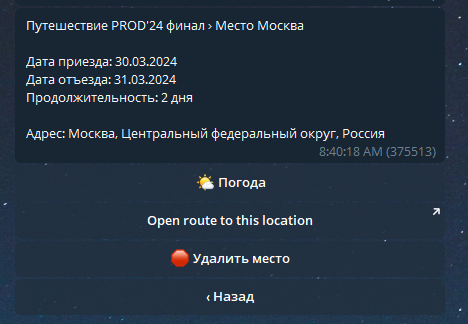

# Travel agent 3.0

# Запуск
В обоих случаях нужно передать следующие переменные окружения:

| Название  | Описание                                             |
|-----------|------------------------------------------------------|
| BOT_TOKEN | Токен бота из @BotFather                             |
| OWM_APPID | Параметр appid для созданного ключа в OpenWeatherMap |

Если вы запускаете приложение через docker-compose, то вы можете создать файл .env в корне проекта и записать туда переменные окружения.

## Docker
Приложение может быть запущено с помощью docker-compose следующей командой:
```bash
docker-compose up -d
```
Будет запущено 3 контейнера: сам бот, PostgreSQL и Redis.
## Локально
В проекте используется `poetry` для управления зависимостями.
1. Установите `poetry` для вашей платформы.
2. `poetry install`
3. `./entrypoint.sh run-polling`

## Разработка и отладка
### Доступ к базе данных
Открыть доступ к базе данных можно, загрузив docker-compose.dev.yml помимо docker-compose.yml:
```bash
docker-compose -f docker-compose.yml -f docker-compose.dev.yml up -d
```
После этого можно подключиться к базе данных через любой удобный клиент, используя параметры из docker-compose.yml.

### entrypoint.sh
В проекте присутствует скрипт для Linux и Windows, который позволяет выполнить некоторые операции:
- `run-polling` - запуск бота в режиме polling;
- `lint` - проверка и исправление ошибок при помощи ruff;
- `test` - **запуск unit-тестов**;
- `update-messages` - обновление файлов переводов;
- `add-locale <locale>` - добавление нового языка для перевода в проект;
- `migrate` - создание новых файлов миграций.

## Стек

В проекте используются следующие библиотеки и технологии:

1. Python 3.12;
2. Aiogram - асинхронный фреймворк для работы с Telegram API. Это наиболее популярная библиотека для создания ботов.
3. Aiogram_dialog - библиотека для создания диалоговых интерфейсов;
   Она переворачивает подход к написанию ботов с ног на голову - из императивного в декларативный, 
   в результате чего код становится более понятным для чтения;
4. Tortoise-ORM; aerich - быстрый асинхронный ORM с понятным стилем, похожим на Django ORM;
5. PostgreSQL - одна из популярных СУБД, используется для хранения данных;
6. Redis - используется библиотекой aiogram и aiogram_dialog для сохранения текущего состояния диалога,
   в том числе между перезапусками бота;
7. Babel - локализация приложения в стиле gettext;
8. Docker - для инкапсуляции приложения и его зависимостей (требуется по ТЗ).

## Внешние интеграции

| Название       | Описание                                               | Где используется                               |
|----------------|--------------------------------------------------------|------------------------------------------------|
| OpenStreetMap  | Открытая онлайн-карта со свободным доступом            | Ввод домашнего адреса, выбор места путешествия |
| OpenWeatherMap | Платно-бесплатный сервис для доступа к данным о погоде | Прогноз погоды в местах путешествия            |

## Схема базы данных


## Функционал

### Регистрация
Каждый пользователь должен пройти регистрацию.
Меню регистрации открывается сразу после запуска бота, если пользователь не был зарегистрирован ранее.
Требуется ввести свой возраст, краткую информацию о себе и указать свой домашний адрес (в текстовом формате или по нажатию кнопки).

### Создание путешествий
Для каждого путешествия нужно ввести его уникальное название, описание (опционально) и список мест (локаций).
Каждая локация имеет в себе название, дату приезда и дату отъезда.

Всего в путешествии может быть не больше 20 локаций.
Технически ничто не мешает увеличить этот лимит до 50, 100 и 200 локаций, но такое ограничение было выбрано в целях быстродействия бота.

### Путешествия с друзьями
В путешествие может быть добавлено несколько участников.

Чтобы добавить кого-то, нужно перейти в раздел Участники - Пригласить кого-то и поделиться полученной ссылкой.
Ссылка действительна сутки с момента создания.
По желанию, ссылку можно сбросить и создать новую.

Если пользователь хочет добавить несколько друзей, он может скопировать ссылку и отправить ее друзьям.

#### Ранговая система
Для упрощения архитектуры бота и простоты понимания все участники между собой равны.
Как таковой роли создателя путешествия не существует.

Поскольку существует возможность добавлять участников, то должна быть возможность их удалять.
И здесь появляется проблема: если дать участнику возможность удалять других участников, то он сможет удалить всех.
Например, он захотел отомстить за какую-то обиду =)

Конечно, не хотелось бы, чтобы такое произошло на самом деле.
Был принят такой вариант: участник `u` может исключить участника `v` только в том случае, если `u` вступил в путешествие раньше `v`.
Для этих целей список пользователей хранится именно в том порядке, в каком эти пользователи вступили в путешествие.
Если пользователь выходит из путешествия, то он удаляется из списка.

Если представить участников путешествия в виде направленного дерева, где ребро u -> v - факт добавления участника v 
в путешествие участником u, то участник `u` может удалить участника `v` только в том случае, 
если существует путь из `u` в `v`. Корнем данного дерева будет являться создатель путешествия.
Можно заметить, что вышеупомянутый список участников будет являться топологической сортировкой этого дерева.

Такой подход имеет полезное свойство: участника, который предоставил ссылку, не может удалить тот участник, который по этой ссылке вступил.
Следствием этого является то, что создателя не может исключить никто и создатель может исключить всех.

### Управление локациями
После создания путешествия можно добавить новые локации. Для этого нужно перейти в раздел Локации - Добавить локацию.
После добавления локации можно просмотреть информацию о ней и удалить её.

### Маршрут путешествия
При открытии конкретного места доступна ссылка на OpenStreetMap, где отображается 
маршрут от предыдущей точки (или от дома) до выбранного места.

### I18n
Для перевода бота на другие языки используется библиотека babel.
На текущий момент поддерживаются английский и русский языки.

При регистрации выбирается язык из профиля Telegram. В дальнейшем его можно изменить. Язык по умолчанию - английский.

## Демонстрация работы бота
### Регистрация


### Редактирование профиля


### Создание путешествия


### Просмотр путешествия


### Просмотр места путешествия


### Приглашение друзей
